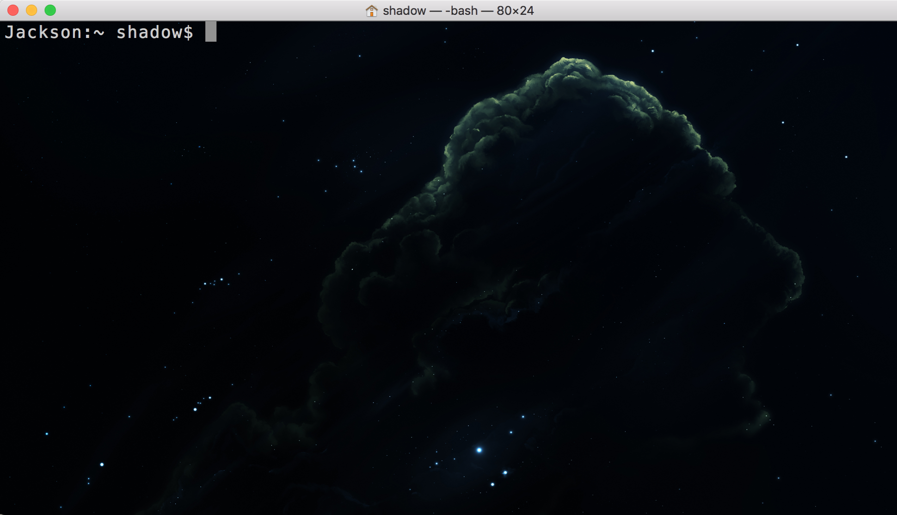
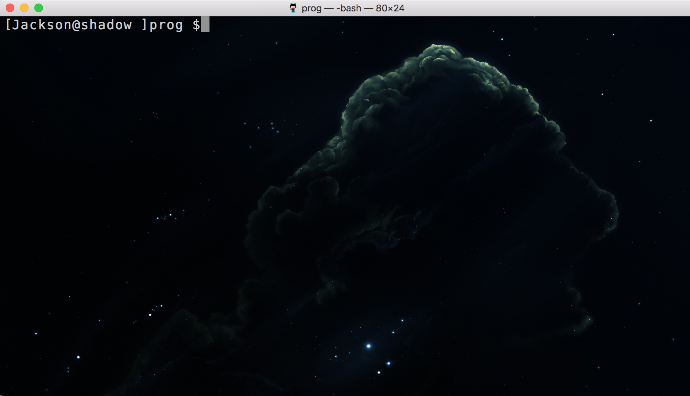
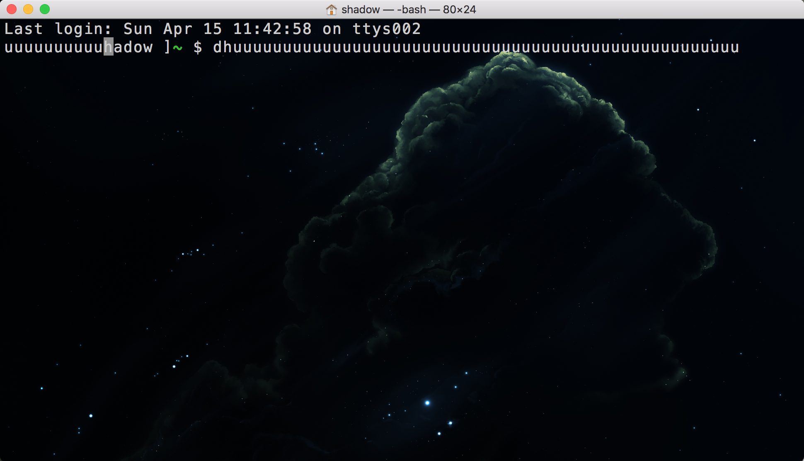

## 0X00
爸爸今天给你们讲个故事，

- 很久很久以前，有一个人，他看到mac的命令行白，看着不舒服，于是他字体设置为灰白色，背景设置为黑色星空图片，于是他的命令行变成了这样 

- 然后看到终端的提示符太乱了，于是他就想“要是把用户信息放前面，工作目录放后面，肯定会好很多，因为最常关注的就是pwd目录了，嗯 就是这样”
于是他的命令行变成了这样 
这一步很简单只要.bash_profile 添加一个`export PS1="[\h@\u ]\W \$"` 

- 后来他又想了，这个提示符格式很好了，但是能不能把work目录颜色高亮一下，这样就更好看了，于是他的shell就变成这样。  
他通过`export PS1="[\h@\u ]\[\033[01;32m\]\W\033[00m\] \$"` 
	- \h host 
	- \u current user
	- \033[01;32m 设置后面的文字颜色为特殊颜色“原谅色”
	- \033[00m 设置后面的颜色为无，即使用系统默认，
	- \$ 权限提示，root为# 

	至于那些反斜线方括号，他没有细看，应该不重要。
- 这个时候他很满意的用起了命令行，他输入，他输入，他输入.... 直到他遇到了那个好朋友，（f敌人就是你的朋友，对吧）一条超长的命令，他发现，命令在第一行行末的时候没有直接换行，而是将第一行覆盖，这样就不知道你之前输入的是啥了。 
- 嗯.....这就很烦人了，他决定改变这个问题，第一天，他用Google他用baidu他把bing，他没查出来，他先放下了，命令只要保证对就可以了，错了再敲一遍吧。他妥协了。转眼六个月过去了，他心情不好，打开了终端，结果又看到了那个烦人的命令行第一行被覆盖，他怒了，他忍不住了，是时候反击了，不能这么一直妥协，当年的热情呢，当年的追求呢，怎么对得起这么多年含辛茹苦的学习的代码水平，日日夜夜坚持不懈写的bug，他继续逛论坛，贴吧，看man bash，那几百页的文档，就在那原来的他抓到了一段话

        \[     begin  a sequence of non-printing characters, which could
               be used to embed a terminal  control  sequence  into  the
               prompt
        \]     end a sequence of non-printing characters
这段话什么意思呢，英语不熟悉的人可能不知道，我来给大家解释一下就是“你这个傻X，都告诉你括号很有用了，你居然不看。” 
- 最后尝试了一下`export PS1="[\h@\u ]*ce*\[\033[01;32m\]\W\[\033[00m\] \$"`问题解决了，他知道了 因为PS1的非打印元素没有被反斜线方括号完全包裹，导致了这个问题，于是他决定记录下来，以后给大家讲一个故事。这个故事名字叫**mac shell 提示符的颜色设置和问题**

好了  故事讲完了，是不是该给个星星了。我跪下来求一个好不好。

